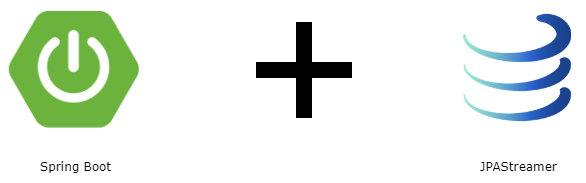
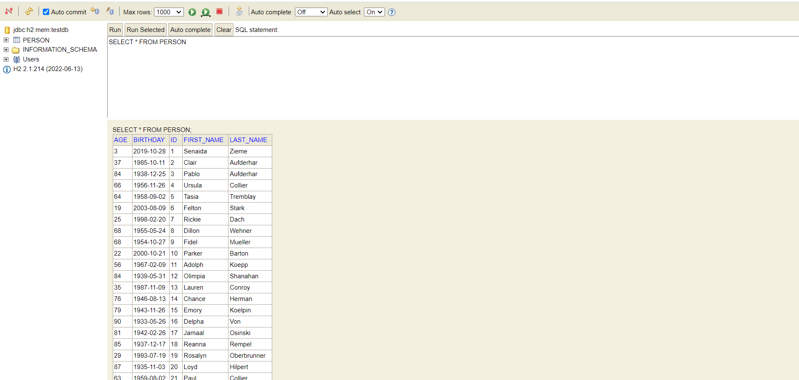
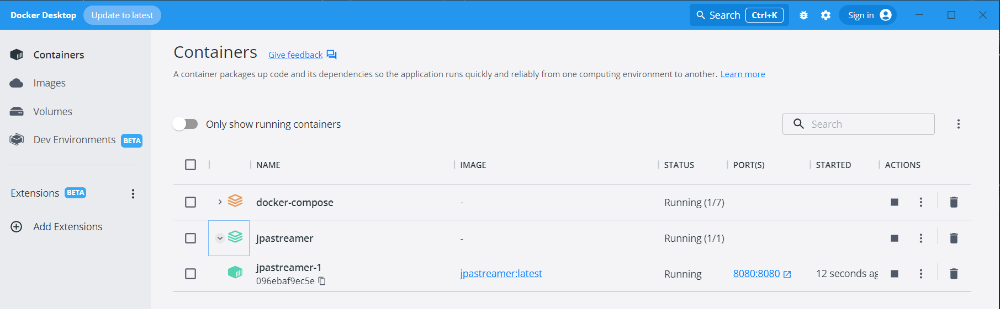
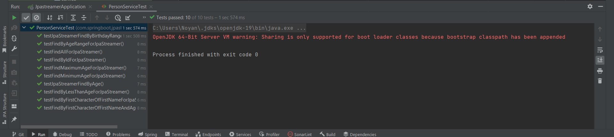
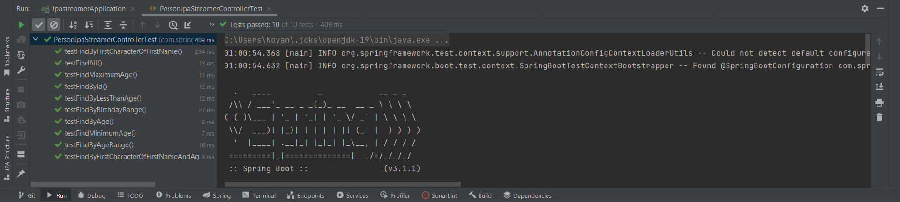

# Spring Boot JpaStreamer Example

<p align="center">
    
</p>

### 📖 Information

<ul style="list-style-type:disc">
  <li>The <b>purpose</b> of the example is to handle with writing queries with the usage of <b>JPASteamer</b> library</li> 
  <li>Here is the explanation of the example
       <ul>
            <li>Load initial data about Person into h2 database through <b>JavaFaker</b> library</li>
            <li>Get person list or person object from the <b>database</b> with the usage of <b>JPASteamer</b> through collect, filter, range, equal, less than, starts with, between and so on</li>
       </ul>
  </li>
</ul>

### Explore Rest APIs

<table style="width:100%">
  <tr>
      <th>Method</th>
      <th>Url</th>
      <th>Description</th>
      <th>Valid Path Variable</th>
      <th>No Path Variable</th>
  </tr>
  <tr>
      <td>GET</td>
      <td>/persons/jpastreamer/all</td>
      <td>Get All Person List</td>
      <td><a href="README.md#getAllPersons">Info</a></td>
      <td></td>
  </tr>
  <tr>
      <td>GET</td>
      <td>/persons/jpastreamer/{id}</td>
      <td>Get Person By Id</td>
      <td><a href="README.md#getPersonById">Info</a></td>
      <td></td>
  </tr>
  <tr>
      <td>GET</td>
      <td>/persons/jpastreamer/findByFirstCharacterOfFirstName/{character}</td>
      <td>Get Person List By First Character of Firstname</td>
      <td><a href="README.md#getPersonListByFirstCharacterOfFirstName">Info</a></td>
      <td></td>
  </tr>
  <tr>
      <td>GET</td>
      <td>/persons/jpastreamer/findByAge/{age}</td>
      <td>Get Person List By Age</td>
      <td><a href="README.md#getPersonListByAge">Info</a></td>
      <td></td>
  </tr>
  <tr>
      <td>GET</td>
      <td>/persons/jpastreamer/findByLessThanAge/{age}</td>
      <td>Get Person List By Age Less Than</td>
      <td><a href="README.md#getPersonListByLessThanAge">Info</a></td>
      <td></td>
  </tr>
  <tr>
      <td>GET</td>
      <td>/persons/jpastreamer/findByFirstCharacterOfFirstNameAndAge/{character}/{age}</td>
      <td>Get Person List By First Character of Firstname and Age</td>
      <td><a href="README.md#getPersonListByFirstCharacterOfFirstNameAndAge">Info</a></td>
      <td></td>
  </tr>
  <tr>
      <td>GET</td>
      <td>/persons/jpastreamer/findByAgeRange/{age1}/{age2}</td>
      <td>Get Person List By Age Range</td>
      <td><a href="README.md#getPersonListByAgeRange">Info</a></td>
      <td></td>
  </tr>
  <tr>
      <td>GET</td>
      <td>/persons/jpastreamer/findMaximumAge</td>
      <td>Get Person By Maximum Age</td>
      <td></td>
      <td><a href="README.md#getPersonByMaximumAge">Info</a></td>
  </tr>
  <tr>
      <td>GET</td>
      <td>/persons/jpastreamer/findMinimumAge</td>
      <td>Get Person By Minimum Age</td>
      <td></td>
      <td><a href="README.md#getPersonByMinimumAge">Info</a></td>
  </tr>
  <tr>
      <td>GET</td>
      <td>/persons/jpastreamer/findByBirthdayRange/{startDate}/{endDate}</td>
      <td>Get Person List By Birthday Range</td>
      <td><a href="README.md#getPersonByBirthdayRange">Info</a></td>
      <td></td>
  </tr>
</table>


### Valid Path Variable

##### <a id="getAllPersons"> Get All Person List
```
    http://localhost:8080/persons/jpastreamer/all
```

##### <a id="getPersonById"> Get Person By Id
```
    http://localhost:8080/persons/jpastreamer/1
```

##### <a id="getPersonListByFirstCharacterOfFirstName"> Get Person List By First Character of Firstname
```
    http://localhost:8080/persons/jpastreamer/findByFirstCharacterOfFirstName/K
```

##### <a id="getPersonListByAge"> Get Person List By Age
```
    http://localhost:8080/persons/jpastreamer/findByAge/35
```

##### <a id="getPersonListByLessThanAge"> Get Person List By Age Less Than
```
    http://localhost:8080/persons/jpastreamer/findByLessThanAge/60
```

##### <a id="getPersonListByFirstCharacterOfFirstNameAndAge"> Get Person List By First Character of Firstname and Age
```
    http://localhost:8080/persons/jpastreamer/findByFirstCharacterOfFirstNameAndAge/J/45
```

##### <a id="getPersonListByAgeRange"> Get Person List By Age Range
```
    http://localhost:8080/persons/jpastreamer/findByAgeRange/10/60
```

##### <a id="getPersonByBirthdayRange"> Get Person List By Birthday Range
```
    http://localhost:8080/persons/jpastreamer/findByBirthdayRange/1990-01-01/2023-07-13
```

### No Path Variable

##### <a id="getPersonByMaximumAge"> Get Person By Maximum Age
```
    http://localhost:8080/persons/jpastreamer/findMaximumAge
```

##### <a id="getPersonByMinimumAge"> Get Person By Minimum Age
```
    http://localhost:8080/persons/jpastreamer/findMinimumAge
```

### Technologies

---
- Java 17
- Spring Boot 3.0
- Restful API
- Lombok
- Maven
- Junit5
- Mockito
- Integration Tests
- Docker
- Docker Compose
- JpaSteamer
- JavaFaker

### Prerequisites

---
- Maven or Docker
---


### Docker Run
The application can be built and run by the `Docker` engine. The `Dockerfile` has multistage build, so you do not need to build and run separately.

Please follow directions shown below in order to build and run the application with Docker Compose file;

```sh
$ cd jpastreamer
$ docker-compose up -d
```

If you change anything in the project and run it on Docker, you can also use this command shown below

```sh
$ cd jpastreamer
$ docker-compose up --build
```

---
### Maven Run
To build and run the application with `Maven`, please follow the directions shown below;

```sh
$ cd jpastreamer
$ mvn clean install
$ mvn spring-boot:run
```

### Screenshots

<details>
<summary>Click here to show the screenshots of project</summary>
    <p> Figure 1 </p>
    
    <p> Figure 2 </p>
    
    <p> Figure 3 </p>
    
    <p> Figure 4 </p>
    
</details>